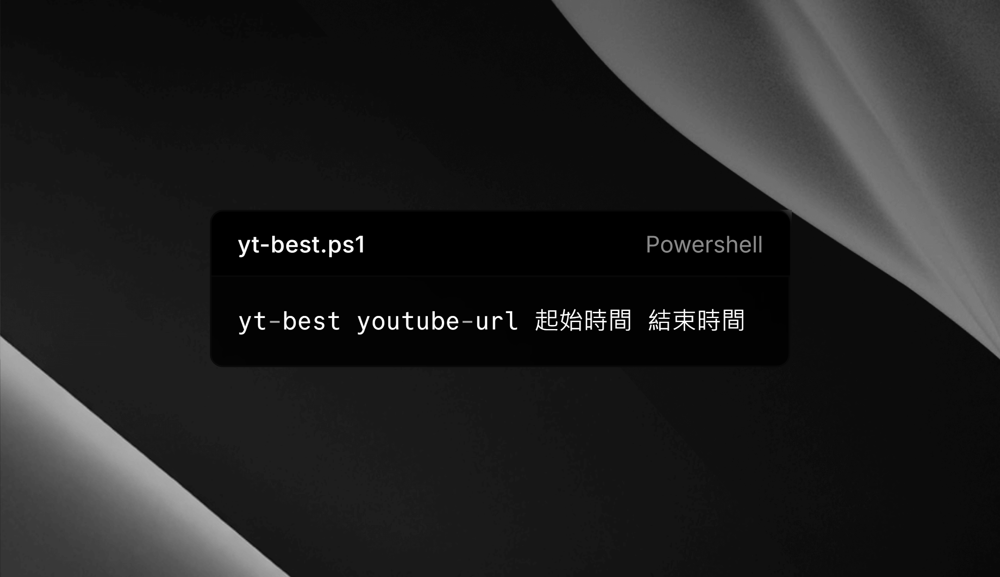

# yt-best



從 YouTube 下載指定時間片段，並以 NVENC 轉成可在 Windows 預覽的 MP4。
目前為 windows 專用，有 Mac 或手機需求的要自己下載請 AI 改。

## 您必須先安裝這些

- [PowerShell](https://learn.microsoft.com/zh-tw/powershell/scripting/install/install-powershell-on-windows?view=powershell-7.6)（用這個執行指令）
- [yt-dlp](https://github.com/yt-dlp/yt-dlp)（用於解析串流路徑跟查詢命名）
- [ffmpeg](https://ffmpeg.org/)（用於串流下載以及重新壓縮，NVIDIA 顯卡驅動裝好才能用 NVENC）
- [Deno](https://deno.com/)（用於 YouTube JS 解析）

## 安裝

```
.\install.ps1
```

會自動複製 `yt-best.ps1` 到 `%USERPROFILE%\.local\bin`，並設定 PATH / PATHEXT。

## 用法

簡單說就是用 PowerShell 打開後輸入：

```
yt-best youtube-url 起始時間 結束時間
```

舉例：

```
yt-best https://www.youtube.com/watch?v=vBX1GpS8qLk 55:41 1:00:48
```

他會自動跑這個流程：

1. yt-dlp 以 HLS 下載指定片段到 `temp-clip-....mp4`
2. 會自動用 ffmpeg NVENC H.264（CQ 35）+ 音訊 copy + faststart 重壓縮小檔案跟同步影音問題
3. 成功後刪除 temp 檔；中斷或失敗時保留 temp 檔

最後給你的檔名是：

```
clip-{YouTube 標題}-{開始時間}_{結束時間}.mp4
```
