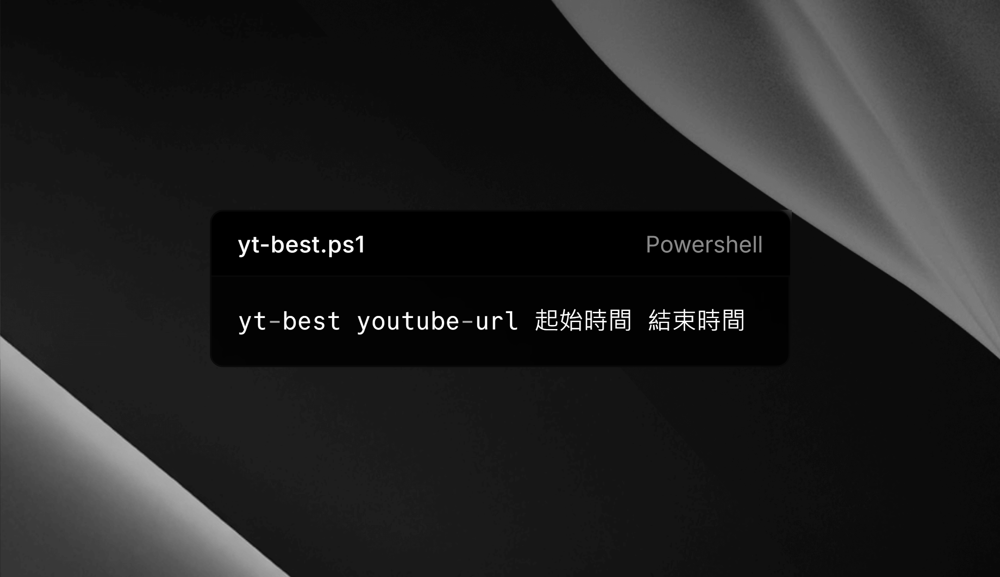

# yt-best



從 YouTube 下載指定時間片段，並以 NVENC 轉成可在 Windows 預覽的 MP4。
目前為 windows 專用，有 Mac 或手機需求的要自己下載請 AI 改。

## 您必須先安裝這些

- [PowerShell](https://learn.microsoft.com/zh-tw/powershell/scripting/install/install-powershell-on-windows?view=powershell-7.6)（用這個執行指令）
- [yt-dlp](https://github.com/yt-dlp/yt-dlp)（用於解析串流路徑跟查詢命名）
- [ffmpeg](https://ffmpeg.org/)（用於串流下載以及重新壓縮，NVIDIA 顯卡驅動裝好才能用 NVENC）
- [Deno](https://deno.com/)（用於 YouTube JS 解析；未安裝時會嘗試改用 Node.js）

## 安裝

```
.\install.ps1
```

會自動複製 `yt-best.ps1` 到 `%USERPROFILE%\.local\bin`，並設定 PATH / PATHEXT。

## 用法

簡單說就是用 PowerShell 打開後輸入：

```
yt-best youtube-url 起始時間 結束時間
```

舉例：

```
yt-best https://www.youtube.com/watch?v=vBX1GpS8qLk 55:41 1:00:48
```

他會先檢查影片是否提供 HLS 串流，再自動選擇下載方式：

**有 HLS（預設路徑）**

1. yt-dlp 以 `--download-sections` 只下載指定片段到 `temp-clip-....mp4`（AV1 HLS 優先，無 AV1 時退回 H.264 HLS）
2. ffmpeg NVENC H.264（CQ 35）+ 音訊 copy + faststart 轉檔 → `clip-....mp4`

**沒有 HLS（需確認）**

1. 提示是否改為整支下載（最佳視訊 + 最佳音訊）
2. yt-dlp 下載完整影片到 `temp-clip-....mp4`
3. ffmpeg stream copy 裁切指定時段到 `trim-clip-....mp4`
4. ffmpeg NVENC 轉檔 → `clip-....mp4`

**暫存檔續跑**

- 已有可用的 `temp-*.mp4` 會跳過下載；下載失敗但暫存檔可用也會繼續
- 非 HLS 路徑下，已有通過驗證的 `trim-*.mp4` 會跳過裁切（異常大的裁切檔會強制重做）
- 成功後刪除暫存檔；中斷或失敗時保留，方便重新執行

**進度顯示**

- yt-dlp 下載進度在同一行更新
- ffmpeg 裁切顯示 `[TRIM]`、轉檔顯示 `[ENC]`

最後給你的檔名是：

```
clip-{YouTube 標題}-{開始時間}_{結束時間}.mp4
```

完成後也會印出來源分享資訊（標題、網址、時段）。

## Changelog

### 2026-07-07

- **HLS 備援路徑**：沒有 m3u8 時可選擇整支下載 → stream copy 裁切 → NVENC 轉檔
- **裁切與轉檔拆分**：非 HLS 路徑新增 `trim-*.mp4` 中間檔，裁切與轉檔分開執行
- **暫存檔續跑**：`temp-*.mp4` / `trim-*.mp4` 存在且可用時跳過對應步驟；裁切檔大小異常會自動重做
- **單行進度**：ffmpeg 進度以 `[TRIM]` / `[ENC]` 在同一行更新
- **標題取得**：改用 JSON 編碼，含 `#` 的 YouTube 標題不會被截斷
- **JS runtime**：優先 Deno，找不到時改用 Node.js
- **`--no-playlist`**：避免帶 `list` 參數的網址被當成播放清單下載

### 較早

- HLS 格式選擇改為 AV1 優先（301/300），並加入 H.264 HLS 備援（96/95/93/91）
